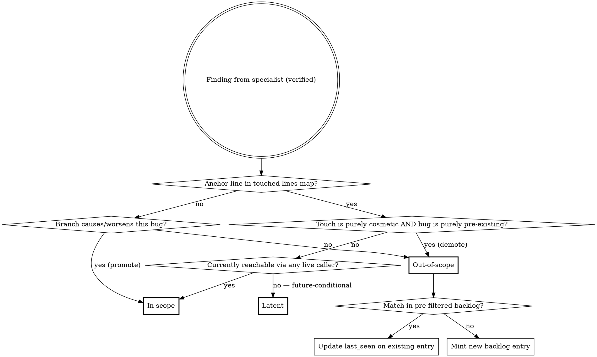
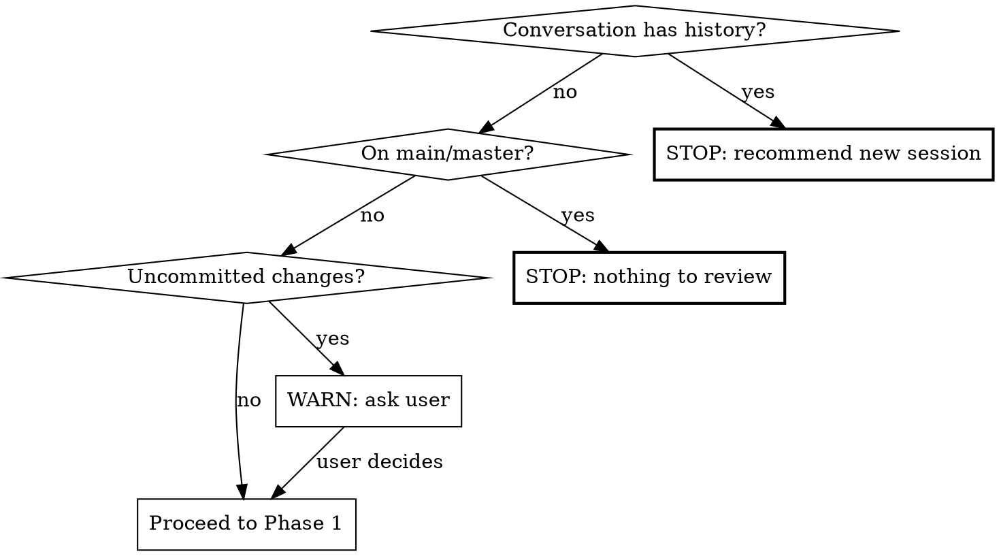

**On invocation:** announce "Running paad:agentic-review v1.13.1" before anything else.

# Agentic Code Review

Multi-agent bug-hunting review of the current branch against main. Dispatches specialist agents in parallel, verifies findings to filter false positives, ranks by severity, and produces a persistent report.

**This is a technique skill.** Follow the phases in order. Do not skip verification.

## Definitions

**In-scope** for the current branch means: this branch's changes either *caused* the bug to be reachable in the running code, or *worsened* it (made it more likely to fire, expanded its blast radius, removed a guard that was masking it, added a new caller into broken code, etc.). The bug is reachable today via at least one live code path.

**Latent** means: the branch *introduced or modified* the lines, but the bug is not currently reachable through any live code path — every current caller observes correct behavior. The risk is future-conditional: a defense-in-depth gap in a newly-introduced pattern, a load-bearing assumption that will fail open if a future code path forgets to honor it, or a brittle pattern that will trip the next time someone extends it. Latent findings live with the branch (the branch authored them) but do not block merge; they are recorded inline in the report so the next change in this area is informed.

**Out-of-scope** means: the bug is purely pre-existing — the branch does not introduce, modify, or reach it differently — even when it lives in files the branch touches.

## Mechanism

Classification is **hybrid blame + reasoning**:

1. **Blame default.** Every finding's `file:line` is checked against a pre-computed touched-lines map (see Phase 1). If the line falls within a touched range → tentatively **in-scope**. Otherwise → tentatively **out-of-scope**.
2. **Reasoning promotion.** For tentatively out-of-scope findings only, the verifier asks: "Does this branch's diff cause this bug to fire when it didn't before, or measurably increase its probability/blast radius?" If yes → promote to **in-scope**. If the bug is purely pre-existing and the branch doesn't reach it differently → confirmed **out-of-scope**.
3. **Cosmetic-touch demotion.** A finding on touched lines defaults to in-scope, but the verifier may demote to out-of-scope when **both** of the following hold: (a) the branch's edits to those specific lines are purely cosmetic (whitespace, comment additions, line splits, identifier renames that don't change semantics), and (b) the bug itself is purely pre-existing — the cosmetic touch did not introduce, expose, or alter the bug's behavior. If either condition fails (semantic edit on the line, or the touch interacts with the bug), the finding stays in-scope.
4. **Latent classification.** A finding on touched lines is classified as **Latent** when *all* of the following hold: (a) the anchor line is in the touched-lines map, (b) the bug is not currently reachable via any live code path (every existing caller observes correct behavior), and (c) reachability depends on hypothetical future code — a forgotten sanitize call, a future feature that adopts the brittle pattern, or a code path that doesn't yet exist. Latent is for *defense-in-depth gaps in newly-introduced patterns* and *load-bearing assumptions made by this branch*, not for "the branch could have made this safer." If a current code path triggers the bug, the finding is in-scope, not latent. Latent findings are reported inline but do not block merge and do not enter the OOS backlog (the branch authored them; the report is the record).

Out-of-scope findings are **semantically deduped** by the verifier against a **file-filtered slice** of `paad/code-reviews/backlog.md`. Before invoking the verifier, the orchestrator pre-filters the backlog to entries whose `File (at first sighting)` path matches a file in the current review's manifest (changed + adjacent). Match → emit an update directive (`{id, last_seen, branch, sha}`). No match → mint a new entry with a stable 8-char hex ID hashed from `file + symbol + bug-class + first-seen-iso-date`.

Backlog **lifecycle is explicit-removal only** — agentic-review never auto-resolves entries. Downstream agents (or the user) delete the entry when the item is addressed. `git log` on the file is the audit trail.



## Arguments

`/paad:agentic-review` accepts optional `$ARGUMENTS`:

- `/paad:agentic-review` — review all changes on the current branch against `main`
- `/paad:agentic-review develop` — review against a different base branch (e.g., `develop` instead of `main`)
- `/paad:agentic-review main src/auth/` — review against `main`, but only for files under `src/auth/`

When a base branch is provided, use it instead of `main` in all `git diff` commands. When a path is provided, filter the diff and manifest to only include files within that scope.

## Pre-flight Checks



1. **Context window:** If conversation has substantive history beyond invoking this skill, tell the user: "This review consumes significant context. Start a fresh session with `/paad:agentic-review` to avoid context rot." Stop and wait.
2. **Branch:** Must not be on main/master. If so, stop.
3. **Clean state:** If uncommitted changes exist, ask: review committed state only, or wait to commit?

## Phase 1: Reconnaissance

Run these commands and collect results:

1. `git diff --stat <base>...HEAD` — files and line counts
2. `git diff <base>...HEAD` — full diff content
3. Classify diff size:
   - **Small:** <50 lines changed
   - **Medium:** 50-500 lines changed
   - **Large:** 500+ lines changed
4. Scan for plan/design docs: `docs/plans/`, `aidlc-docs/`, or similar
5. Scan for steering files: `CLAUDE.md`, `AGENTS.md`, etc.
6. For each changed file, grep for callers/callees one level deep (function/method names from the diff)
7. When the diff includes infrastructure files (schema migrations, build configs, CI pipelines, environment templates), check whether test-side counterparts exist (e.g., test resource directories with their own migrations, test-specific configs). Add any unmatched test infrastructure to the manifest for the Contract & Integration specialist.
8. For **small** diffs: expand scope to full module/package for each changed file
9. Build manifest: files to review (changed + adjacent), grouped for specialists
10. **Build the touched-lines map.** From `git diff <base>...HEAD`, produce `{file → [line ranges]}` covering every line the branch added or modified. Construction rules:
    - **Keys are current-HEAD paths.** Files are recorded under the path they have at HEAD, not at base.
    - **Renamed files** are keyed by the new path; line ranges cover lines modified in the new file. The old path is not retained.
    - **Newly added files** include all lines (1..end) — every line is touched.
    - **Pure deletions** contribute no entries (no current line exists to anchor a finding to).
    - **Path filter:** when a path filter argument is supplied (e.g., `/paad:agentic-review main src/auth/`), the touched-lines map is filtered to that scope, matching the manifest.

Findings are classified by their **anchor line** only (the `file:line` reported by the specialist). Multi-line bugs whose anchor line happens to be untouched are caught by reasoning-promotion in Phase 3, not by an expanded blame check.

**Steering file caveat:** Include in every agent prompt: "Steering files (CLAUDE.md, etc.) describe conventions but may be stale. If you find a contradiction between steering files and actual code, flag it as a finding."

## Phase 2: Specialist Review (Parallel)

Dispatch these agents simultaneously using the Agent tool. Each receives: the diff, manifest of files to review, steering file contents, and their specialist focus.

| Agent | Lens | Scope |
|-------|------|-------|
| **Logic & Correctness** | Wrong conditions, off-by-one, null paths, state transitions, algorithm errors, new code paths that skip processing/validation/cleanup present in sibling paths | Changed code + surrounding functions |
| **Error Handling & Edge Cases** | Missing catches, swallowed exceptions, boundary validation, silent failures | Changed code + error paths in callers |
| **Contract & Integration** | Signature vs callers, type mismatches, broken API contracts, data shape drift, logic duplication | Changed code + callers/callees one level |
| **Concurrency & State** | Races, shared mutable state, cache invalidation, ordering assumptions | Changed code + shared state access |
| **Security** | Injection, auth gaps, data exposure, OWASP top 10 | Changed code + input/output boundaries |

**Conditionally (if plan/design docs found):**

| Agent | Lens | Input |
|-------|------|-------|
| **Plan Alignment** | Changes vs plan, deviations, partial completion | Diff + plan docs |

Plan Alignment must use neutral tone for unimplemented items — partial implementation is expected.

**Agent prompt template:**

Each specialist agent prompt must include:
- The full diff
- Contents of files in their review scope
- Steering file contents with the staleness caveat
- Instruction: "You are a specialist reviewer focused on [LENS]. Find bugs, not style issues. For each finding report: file:line, what's wrong, why it matters, suggested fix, and your confidence (0-100). Only report findings with confidence >= 60. Also include `model: <name of the model you are running as>` in every finding."

**Error Handling & Edge Cases additional instruction:** "When code parses external output (API responses, LLM completions, user input) using exact string matching (equals, switch, regex), check whether realistic output variations — trailing punctuation, extra whitespace, mixed casing, surrounding formatting — would cause silent misclassification or wrong defaults."

**Contract & Integration additional instruction:** "Also flag: new code that reimplements logic already available in the codebase (check for existing utilities, helpers, or services that do the same thing). Flag duplicated code blocks within the diff that could be parameterized into a single function. Frame these as integration issues — duplicated logic diverges over time and causes bugs."

**Scaling for large diffs (500+ lines):** Partition files across 2 instances of each specialist (e.g., Logic-A gets half the files, Logic-B gets the other half).

## Phase 3: Verification

After all specialists complete, dispatch a single **Verifier** agent with all findings. The verifier:

1. For each finding, reads the actual current code at the referenced file:line
2. Confirms the bug exists and isn't handled elsewhere
3. Drops false positives and findings below 60% confidence
4. Assigns severity: **Critical** / **Important** / **Suggestion**
5. Deduplicates findings flagged by multiple specialists (note which specialists agreed)
6. **Classifies** each surviving finding as `in-scope`, `latent`, or `out-of-scope` using the rules in the Mechanism section. Inputs required: the touched-lines map (from Phase 1) and the diff. Apply blame default → reasoning promotion → cosmetic-touch demotion → latent classification in that order.
7. **Backlog dedup** for out-of-scope findings only (latent and in-scope findings do NOT enter the backlog — the branch authored them). Inputs required: a **pre-filtered slice** of `paad/code-reviews/backlog.md` containing only entries whose `File (at first sighting)` path matches a file in the manifest. For each out-of-scope finding:
   - **Match** → emit `{id, last_seen, branch, sha}` update directive.
   - **No match** → mint a new entry with a fresh 8-char hex ID hashed from `file + symbol + bug-class + first-seen-iso-date`.

Verifier output is three lists: in-scope findings (with severity), latent findings (with severity — informational, not merge-blocking), and out-of-scope findings (with severity, backlog ID, and `new` vs `re-seen` flag).

**Verifier prompt must include:** "You are verifying bug reports. For each finding, read the actual code and confirm the bug exists. Be skeptical — reject anything you cannot confirm by reading the code. A finding reported by multiple specialists is more likely real. Then classify each surviving finding as in-scope, latent, or out-of-scope per the Definitions and Mechanism sections. For latent findings, your report MUST include: (a) which current code path keeps the bug unreachable today, (b) what hypothetical future change would make it reachable, (c) a safe-by-construction hardening (e.g. lift validation into a shared utility, add an ESLint rule, narrow a type). For out-of-scope findings, dedup against the provided backlog slice."

## Phase 4: Report

Write verified findings to `paad/code-reviews/<branch>-<YYYY-MM-DD-HH-MM-SS>-<short-sha>.md`.

Create the `paad/code-reviews/` directory if it doesn't exist.

**Empty-section rules:**

- If there are zero out-of-scope findings of any tier, omit the entire `## Out of Scope` section *and* the handoff block. Review Metadata still records `Out-of-scope findings: 0`.
- If there are zero in-scope findings of a tier but out-of-scope findings exist, write each empty in-scope tier section as `None found.` (existing convention) and write the Out of Scope section normally.
- If there are zero latent findings, omit the entire `## Latent` section. Review Metadata still records `Latent findings: 0`.

**Failure handling:**

- If writing `paad/code-reviews/backlog.md` fails for any reason (permissions, disk, malformed existing file), surface the error to the user and write the per-review report anyway. The report is the authoritative deliverable; the backlog is a convenience layer.

**Report template:**

```markdown
# Agentic Code Review: <branch-name>

**Date:** YYYY-MM-DD HH:MM:SS
**Branch:** <branch> -> <base>
**Commit:** <full-sha>
**Files changed:** N | **Lines changed:** +X / -Y
**Diff size category:** Small / Medium / Large

## Executive Summary

2-3 sentences: overall assessment, highest-severity finding if any, general confidence level.

## Critical Issues

### [C1] <title>
- **File:** `path/to/file:line`
- **Bug:** What's wrong
- **Impact:** Why it matters
- **Suggested fix:** Concrete recommendation
- **Confidence:** High/Medium
- **Found by:** <specialist> (`<model>`)

(Repeat for each critical issue, or "None found.")

## Important Issues

(Same structure as Critical, or "None found.")

## Suggestions

One-line entries only. If empty, follow the Empty-section rules above.

## Latent

> Findings on lines this branch authored where the bug is not currently reachable
> via any live code path, but the pattern itself is brittle or load-bearing for
> future work. **Not a merge-blocker** — record so the next change in this area
> is informed. Does not enter the OOS backlog (the branch authored these).

### [LAT1] <title>
- **File:** `path/to/file:line`
- **Bug:** What's wrong
- **Why latent:** Which current code path keeps this unreachable today
- **What would make it active:** Hypothetical future change that would trip it
- **Suggested hardening:** Safe-by-construction fix (lift validator into shared, add ESLint rule, narrow type, etc.)
- **Confidence:** High/Medium
- **Found by:** <specialist> (`<model>`)

(Repeat for each, or omit the entire Latent section if there are zero — see Empty-section rules.)

## Out of Scope

> **Handoff instructions for any agent processing this report:** The findings below are
> pre-existing bugs that this branch did not cause or worsen. Do **not** assume they
> should be fixed on this branch, and do **not** assume they should be skipped.
> Instead, present them to the user **batched by tier**: one ask for all out-of-scope
> Critical findings, one ask for all Important, one for Suggestions. For each tier, the
> user decides which (if any) to address. When you fix an out-of-scope finding, remove
> its entry from `paad/code-reviews/backlog.md` by ID.

### Out-of-Scope Critical
#### [OOSC1] <title> — backlog id: `<id>`
- **File:** `path/to/file:line`
- **Bug:** What's wrong
- **Impact:** Why it matters
- **Suggested fix:** Concrete recommendation
- **Confidence:** High/Medium
- **Found by:** <specialist> (`<model>`)
- **Backlog status:** new | re-seen (first logged YYYY-MM-DD)

(Repeat for each, or "None found.")

### Out-of-Scope Important
(Same shape — IDs OOSI1, OOSI2, ...)

### Out-of-Scope Suggestions
(One-line entries; each carries a backlog id — IDs OOSS1, OOSS2, ...)

## Plan Alignment

(Only if plan/design docs were found)
- **Implemented:** Plan items reflected in this diff
- **Not yet implemented:** Remaining items (neutral — partial is expected)
- **Deviations:** Anything contradicting the plan

## Review Metadata

- **Agents dispatched:** <list with focus areas>
- **Scope:** <files reviewed — changed + adjacent>
- **Raw findings:** N (before verification)
- **Verified findings:** M (after verification)
- **Filtered out:** N - M
- **Latent findings:** N (Critical: a, Important: b, Suggestion: c)
- **Out-of-scope findings:** N (Critical: a, Important: b, Suggestion: c)
- **Backlog:** X new entries added, Y re-confirmed (see `paad/code-reviews/backlog.md`)
- **Steering files consulted:** <list or "none found">
- **Plan/design docs consulted:** <list or "none found">
```

## The Backlog File

`paad/code-reviews/backlog.md` is project-wide, append-only, and uses **explicit removal only** — agentic-review never auto-resolves entries. Created on first run if absent.

**Fixed header (preserved across all updates):**

```markdown
# Out-of-Scope Findings Backlog

> **These items were flagged by `/paad:agentic-review` as out of scope for the branch
> on which they were found.** They may be stale, may already have been fixed by other
> means, may no longer apply after refactors, or may simply have been judged not worth
> addressing. Verify each entry against the current code before acting on it. Entries
> are removed only when explicitly addressed — no automatic cleanup.

---
```

**Per-entry shape:**

```markdown
## `<id>` — <one-line title>
- **File (at first sighting):** `path/to/file:line`
- **Symbol:** `<function or class name>`
- **Bug class:** Logic | Error Handling | Contract | Concurrency | Security | Plan
- **Description:** ...
- **Suggested fix:** ...
- **Confidence:** High | Medium
- **Found by:** <specialist> (`<model>`)
- **First seen:** YYYY-MM-DD on branch `<branch>` at `<short-sha>`
- **Last seen:** YYYY-MM-DD on branch `<branch>` at `<short-sha>`
- **Severity:** Critical | Important | Suggestion
```

**Update rule on re-discovery:** rewrite only the `Last seen` line. Everything else is immutable so the entry remains a stable historical record.

**Removal rule:** delete the entire `## <id> — <title>` block. No tombstones, no archive.

**ID format:** 8-char hex of `sha1(file + symbol + bug-class + first-seen-iso-date)`.

**Soft size warning:** when the active backlog reaches **≥ 200 active entries**, surface a warning in the post-review message so accumulation stays visible.

## Common Mistakes

These patterns produce low-quality reviews. Avoid them:

| Mistake | What to do instead |
|---------|-------------------|
| Single-agent review (no parallel dispatch) | Always dispatch 5+ specialist agents in parallel via Agent tool |
| Skipping verification | Always run verifier — unverified findings have high false positive rates |
| Reporting style/quality nits | Specialists hunt **bugs**, not code style. "Missing test" is a suggestion at best, not a bug. |
| Not tracing callers/callees | The best bugs hide at integration boundaries. Always trace one level deep. |
| Not reading adjacent test files | Tests that pass accidentally (via catch-all mocks, wrong stubs) are real bugs. Check sibling tests. |
| Skipping steering files | Read CLAUDE.md etc. for context, but flag contradictions rather than trusting blindly |
| Reporting without file:line references | Every finding must reference exact code location — unanchored findings are not actionable |
| Ignoring logic duplication | New code reimplementing existing helpers is a bug waiting to happen — Contract & Integration agent must check for this |
| Ignoring test infrastructure | When production infrastructure changes (schema migrations, build configs, environment templates), check if parallel test infrastructure exists and needs matching updates |
| Treating out-of-scope findings as fixable on this branch | They are pre-existing — surface them, batch the ask, and let the user decide per tier |
| Dropping out-of-scope findings on the floor | They go in the report's Out of Scope section AND in `backlog.md` — never silently discarded |
| Using Latent as a dumping ground for "anything I want to flag but don't want to call OOS" | Latent requires that no current code path triggers the bug. If a current caller is affected, the finding is in-scope. The Latent gate is reachability today, not severity preference. |
| Putting Latent findings into `backlog.md` | The backlog is for OOS pre-existing bugs. Latent findings were authored by this branch — they live in the report only. |

## Post-Review

After writing the report:
1. Report path and counts: `Critical: N (in-scope) / L (latent) / X (out-of-scope), Important: …, Suggestion: …`.
2. Backlog state: `Backlog: X new entries added, Y re-confirmed, Z total active.`
3. **Latent summary** (only when any latent findings were recorded): announce the count and the report path. Latent findings are informational, not merge-blocking — say so explicitly: *"Found N latent finding(s) — informational, not blocking. See `## Latent` in `<report-path>` for the future-conditional risks this branch introduced and the suggested hardening for each."*
4. **Out-of-scope summary** — clearly announce the out-of-scope count and, when any were found, the exact locations the findings were written to. This step must not be skipped or merged into step 1; it is the user's primary signal that pre-existing bugs surfaced and where to find them.
   - When the total out-of-scope count is **zero**, say plainly: *"No out-of-scope issues found."*
   - When the total out-of-scope count is **greater than zero**, say (filling in the actual numbers and report path): *"Found N out-of-scope issue(s). Written to:*
     - *The `## Out of Scope` section in `<report-path>` — with batched-ask handoff instructions for downstream agents.*
     - *The project-wide backlog at `paad/code-reviews/backlog.md` — X new entries, Y re-confirmed.*
     *Do not assume these should be fixed on this branch."*
5. **Security disclosure warning** (only when this run added one or more `Bug class: Security` entries to the backlog): list the count, the affected files, and tell the user: *"`paad/code-reviews/backlog.md` is committed to this repository by default. If this repo is public or shared outside your team, decide whether to commit these security entries before pushing — you can `.gitignore` the file or remove specific entries."*
6. **Backlog-size soft warning** (only when total active entries ≥ 200): *"Backlog has N active entries — consider triaging stale items."*
7. Tell the user: "To address in-scope findings, review each issue in the report and fix them with per-fix commits. If you have the [superpowers](https://github.com/obra/superpowers/) plugin installed, you can use the `receiving-code-review` skill and point it at this report for a guided workflow. For out-of-scope findings, the report includes batched-ask handoff instructions; any agent following them will prompt you tier-by-tier and remove backlog entries by ID as items are fixed."
8. Do **not** auto-fix anything. The report is the deliverable.
